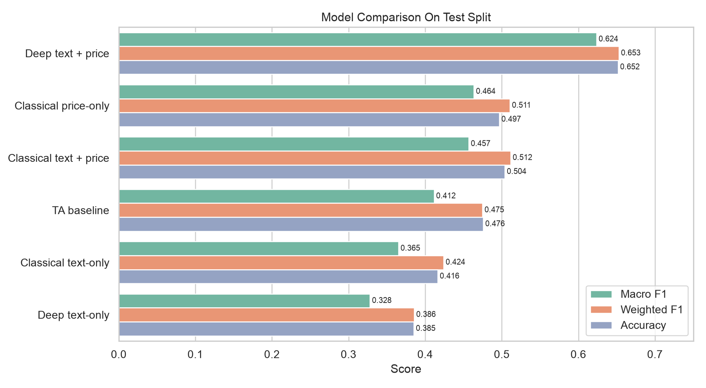
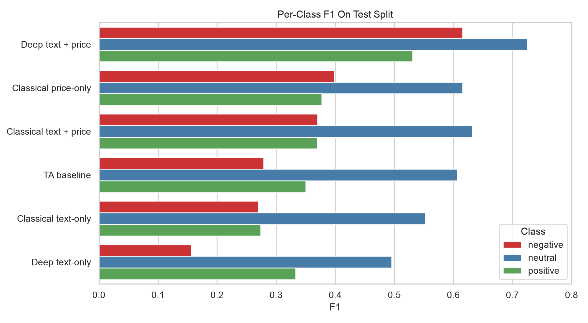
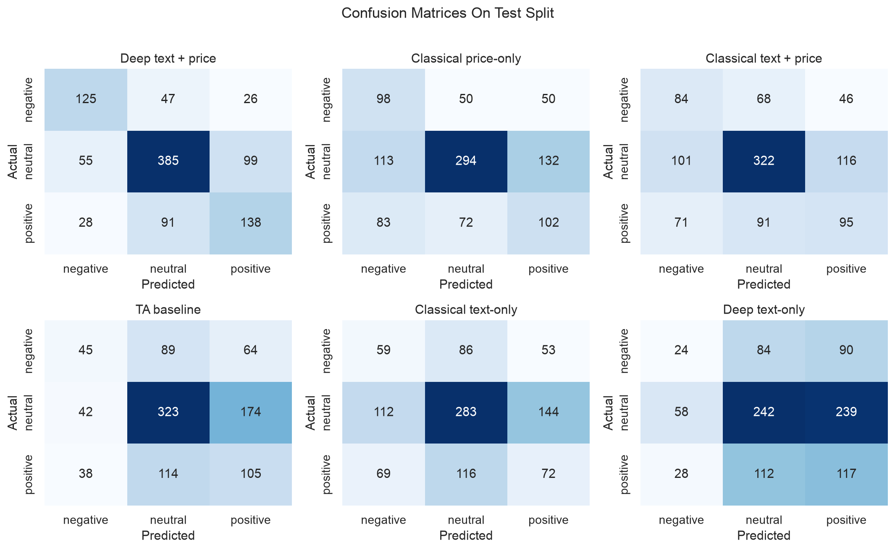
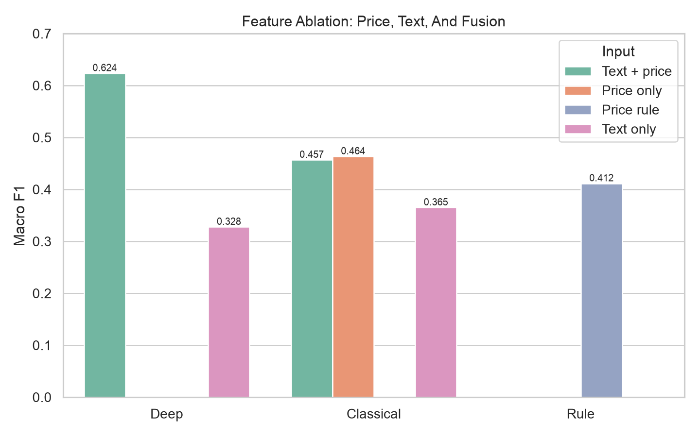
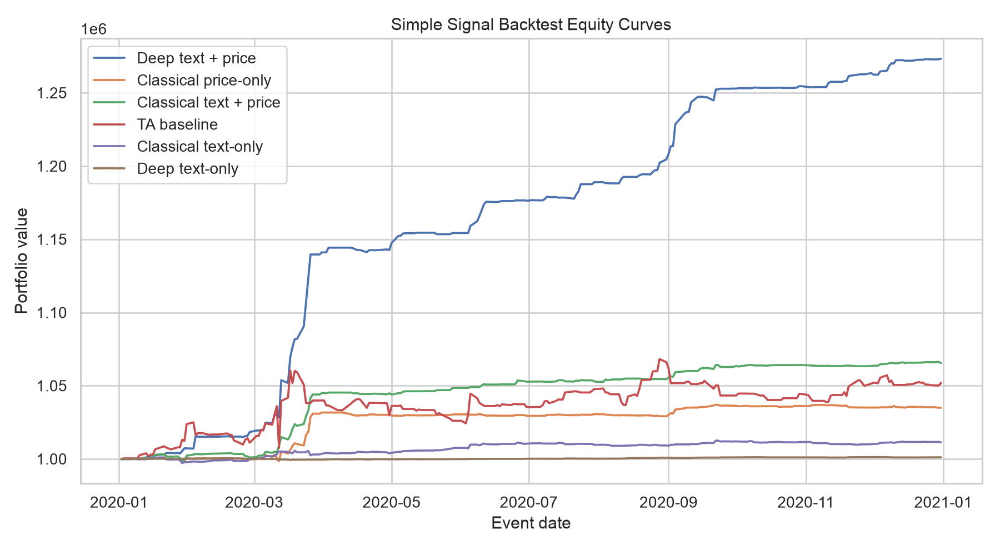
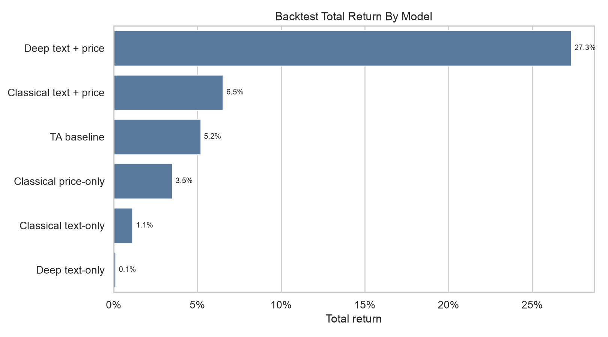
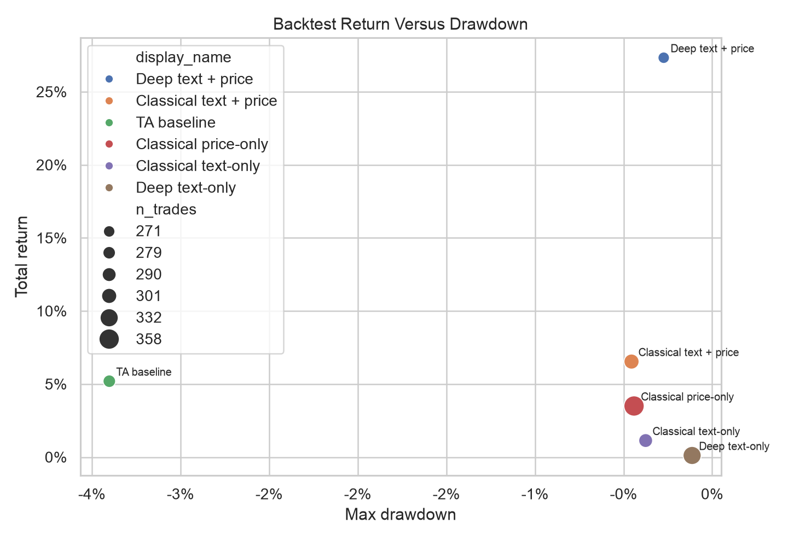

# MarketMood
*Investor Sentiment and Price Context for Abnormal Stock-Move Detection*

## Problem Statement

MarketMood studies whether StockTwits-style investor posts, combined with recent (to post) ticker-level price context, can help detect short-term *abnormal* stock movements. For each post, the system predicts one of three classes for the next trading-day move of the referenced ticker: `positive`, `neutral`, or `negative`, indicating signals of next day *abnormal* price action.

This is an educational research demo only. It is not financial advice and is not intended for real-money trading decisions.

## Data Sources

The text data come from the StockEmotions dataset, downloaded and stored locally in `data/stockemo/`. The available splits contain 10,000 labeled posts, and those are the splits used in this project.

| Split | Rows |
|---|---:|
| Train | 8,000 |
| Validation | 1,000 |
| Test | 1,000 |

The dataset spans January 1, 2020 through December 31, 2020 and covers 37 tickers. The most common tickers are TSLA, AAPL, BA, DIS, and AMZN. Sentiment labels are roughly balanced, with 5,474 bullish posts and 4,526 bearish posts.

Historical daily OHLCV prices are downloaded with `yfinance` and cached locally in `data/prices/{ticker}.csv`. Ticker aliases are used where needed due to symbol changes over time (e.g `BRK.B -> BRK-B` and `FB -> META`).

Note that this project does NOT use the emotion or sentiment manually created labels in the dataset, but rather define another label based on price abnormality. Those labels are only used for analysis and comparison.

## Related Work

This project builds on the StockEmotions dataset and paper, which provide emotion and sentiment annotations for stock-market social-media posts. Prior work on financial NLP commonly models sentiment, market reactions, or price movement from social media, news, and price-history signals. 

* [StockEmotions Github](https://github.com/adlnlp/stockemotions)
* [StockEmotions Paper](https://arxiv.org/abs/2301.09279)
* [Twitter mood predicts the stock market](https://www.sciencedirect.com/science/article/abs/pii/S187775031100007X)

The key contribution of StockEmotions are a set of labeled sentiment and emotion short messages for training, plus comparison of classification models using different algorithms.

MarketMood's contribution is built on top of StockEmotions, and combines that social-media text with market price context for volatility-normalized *abnormal-move* detection. The project is closest to prior financial-text prediction work, but differs by comparing a deterministic technical-analysis rule, classical TF-IDF models, and transformer-plus-price fusion against the same abnormal-return target. There is an UI to explore the effects of messages on top of price trends. In addition, the predictions are backtested using a simple strategy to see how they might be used and what the results might be.

## Evaluation Strategy And Metrics

The primary technical metric for this classification problem is macro F1 because the target distribution is imbalanced toward `neutral`, and a model that performs poorly on `positive` or `negative` abnormal moves should be penalized. Secondary metrics include accuracy, weighted F1, per-class precision/recall/F1, and confusion matrices.

Model selection and hyperparameter tuning use train and validation data only. The test split is reserved for final comparison.

Current modeling-dataset class distribution:

| Split | Negative | Neutral | Positive | Total |
|---|---:|---:|---:|---:|
| Train | 1,721 | 4,226 | 2,000 | 7,947 |
| Validation | 230 | 515 | 254 | 999 |
| Test | 198 | 539 | 257 | 994 |
| All | 2,149 | 5,280 | 2,511 | 9,940 |

## Data Processing Pipeline

The pipeline loads local downloaded StockEmotions train, validation, and test CSVs; parses dates; normalizes ticker symbols; downloads and caches daily OHLCV data from Yahoo Finance; aligns posts to ticker trading dates; constructs leakage-safe price features; builds text input variants; and writes `data/processed/modeling_dataset.csv`.

The event date for a post is the first available ticker trading date on or after the post calendar date. Because it is unknown when during the day the post happens, price features use data through `t-1`. The target uses the future return from `close(t)` to `close(t+1)`.

The abnormal-move score is:

```text
future_return_1d = close(t+1) / close(t) - 1
rolling_vol_20d = standard deviation of daily returns over the prior 20 trading days
abnormal_score = future_return_1d / rolling_vol_20d
```

Labels use threshold `0.75`:

```text
positive if abnormal_score > +0.75
negative if abnormal_score < -0.75
neutral otherwise
```
Basically trying to see if the stock moved unusually far up or down relative to its own recent behavior.

Generated price features include typical technical analysis measures: returns over 1, 3, 5, 10, and 20 days; volatility over 5, 10, and 20 days; 20-day volume z-score; 5- and 20-day moving averages; close-to-SMA20; high-low range; gap return; 20-day range position; and volatility-adjusted breakout/breakdown strength.

## Modeling Approach

The project compares three required modeling families:

1. Naive baseline: a deterministic technical-analysis rule using 20-day range position, volatility-adjusted breakout/breakdown strength, and 5-day momentum.
2. Classical ML: TF-IDF text features, engineered price features, and logistic regression variants.
3. Deep learning: transformer text encoder with optional price-feature MLP fusion.

The focused experiment is an ablation study asking whether investor text adds signal beyond price-only baselines, and whether price context improves text-only models.

## Hyperparameter Tuning Strategy

Hyperparameters were selected using validation macro F1. For classical ML, the main controlled choices are TF-IDF vocabulary size, n-gram range, regularization strength, and feature-set choice. For deep learning, the main controlled choices are encoder, max sequence length, learning rate, batch size, dropout, class weighting, and text-only versus text-plus-price fusion.

This project focused more on comparing ablation variants than on a large hyperparameter search. Sensible defaults were used, and a few variants were run before settling on "good enough" hyperparameters.

## Models Evaluated

| Model | Notes |
|---|---|
| Technical-analysis baseline | Deterministic volatility-adjusted range-breakout rule, no training |
| Classical price-only | Logistic regression over engineered price features |
| Classical text-only | TF-IDF over original post text, logistic regression |
| Classical text + price | TF-IDF plus engineered price features, logistic regression |
| Deep text-only transformer | Frozen DistilBERT embeddings plus classifier head |
| Deep text + price fusion | Frozen DistilBERT embeddings plus engineered-price MLP fusion |

## Results

Quantitative test results:

| Model | Split | Accuracy | Macro F1 | Weighted F1 |
|---|---|---:|---:|---:|
| Deep text + price | Test | 0.652 | 0.624 | 0.653 |
| Classical price-only | Test | 0.497 | 0.464 | 0.511 |
| Classical text + price | Test | 0.504 | 0.457 | 0.512 |
| Technical-analysis baseline | Test | 0.476 | 0.412 | 0.475 |
| Classical text-only | Test | 0.416 | 0.365 | 0.424 |
| Deep text-only | Test | 0.385 | 0.328 | 0.386 |

The full metric table is generated at `outputs/metrics/report_model_comparison.csv`.



Validation results used for model selection:

| Model | Validation Accuracy | Validation Macro F1 | Validation Weighted F1 |
|---|---:|---:|---:|
| Classical price-only | 0.481 | 0.458 | 0.494 |
| Classical text + price | 0.482 | 0.450 | 0.489 |
| Classical text-only | 0.389 | 0.349 | 0.393 |
| Deep text + price | 0.663 | 0.644 | 0.664 |
| Deep text-only | 0.363 | 0.316 | 0.357 |

Per-class F1 shows that the official deep text-plus-price model improves all three classes, with the largest absolute advantage on the directional `negative` and `positive` classes. This is important because the target distribution is neutral-heavy and accuracy alone can hide weak abnormal-move detection.



Deep text-plus-price confusion matrix on the test split, ordered as `negative`, `neutral`, `positive`:

| True \ Predicted | Negative | Neutral | Positive |
|---|---:|---:|---:|
| Negative | 125 | 47 | 26 |
| Neutral | 55 | 385 | 99 |
| Positive | 28 | 91 | 138 |

Technical-analysis baseline confusion matrix, ordered as `negative`, `neutral`, `positive`:

| True \ Predicted | Negative | Neutral | Positive |
|---|---:|---:|---:|
| Negative | 45 | 89 | 64 |
| Neutral | 42 | 323 | 174 |
| Positive | 38 | 114 | 105 |

The generated confusion-matrix panel below compares all evaluated models on the same class order.



The technical-analysis rule is intentionally simple and mirrors the target more closely than pure trailing momentum. It predicts a positive setup when the prior close sits in the top 20% of its recent 20-day range and either 5-day momentum or 20-day breakout strength exceeds `0.75` trailing-volatility units. It predicts a negative setup symmetrically near the bottom 20% of the recent range. All other rows are neutral. On the test set, this produces a more neutral-aware baseline than the earlier pure-momentum rule.

The classical logistic-regression models use only features based on text and engineered price features. They do not use `senti_label` or `emo_label` as model inputs as that would be leakage. The current best classical model by validation macro F1 is price-only logistic regression. Text-only TF-IDF performs worse, suggesting that the StockTwits post text alone is not enough for this target, though the text+price model remains close to price-only on weighted F1 and accuracy. Overall, price context is more informative than posts alone.

The deep-learning models use DistilBERT text embeddings with a classifier head. To keep training practical, the text encoder is frozen by default and only the classification/fusion layers are trained. The deep text-only model remains weak, while the deep text-plus-price fusion model performs best overall, improving test macro F1 to 0.624 and showing that transformer text representations become useful when combined with prior to event market context. The text-only performed so poorly that it is indicative of the investors not really knowing where abnormal pricing will go alone.

The ablation summary supports the same conclusion: price context is the strongest standalone signal, text alone is weak for this target, and deep text-plus-price fusion is the best overall configuration.



A subgroup metric table for the official deep text-plus-price model is generated at `outputs/metrics/report_subgroup_metrics.csv`. The strongest subgroup pattern is by volatility regime: macro F1 is highest in the high-volatility bucket (`0.782`) and lowest in the low-volatility bucket (`0.474`). This is consistent with the project goal, because the target is explicitly about abnormal moves and the signal appears most useful when market conditions are already more active. Ticker-level results also vary substantially, with TSLA performing much better than smaller subgroups such as NFLX or FB, so ticker coverage and sample size remain important limitations.

## Error Analysis

Generated error-analysis artifacts are stored in `outputs/error_analysis/`. The most useful files are:

* `official_high_confidence_mistakes.csv`
* `official_high_confidence_correct.csv`
* `model_disagreements.csv`
* `text_price_wins_over_price_only.csv`
* `price_only_wins_over_text_price.csv`

Representative high-confidence mistakes from the official deep text-plus-price model:

| Ticker | Event date | Actual | Predicted | Confidence | Next-day return | Abnormal score | Likely root cause |
|---|---|---|---|---:|---:|---:|---|
| TSLA | 2020-07-21 | neutral | negative | 91.1% | 1.5% | 0.31 | Model overreacted to directional cues in a neutral target window |
| TSLA | 2020-07-21 | neutral | negative | 90.6% | 1.5% | 0.31 | Model overreacted to directional cues in a neutral target window |
| BA | 2020-03-16 | neutral | positive | 87.3% | -4.2% | -0.60 | Model overreacted to directional cues in a neutral target window |
| MA | 2020-03-17 | neutral | negative | 87.0% | -4.2% | -0.70 | Model overreacted to directional cues in a neutral target window |
| TSLA | 2020-02-18 | positive | neutral | 84.6% | 6.9% | 0.96 | Abnormal move occurred despite a weak directional model signal |

Two major error patterns stand out. First, neutral target windows are difficult when the post contains strong directional language. For example, several TSLA posts around earnings or high-volatility trading days contain confident bearish or bullish cues, but the next-day abnormal score remains below the `0.75` threshold. Second, realized price moves can be driven by external market or company news not present in the post. In those cases, even a plausible message interpretation can miss the target because the model has no explicit news/event feed.

The interpretation is that a few random posts are not complete (so can't see all news), and a few sentiments/emotions may be "wrong".

The model-comparison examples are also useful:

| Case type | Ticker | Event date | Actual | Deep text + price | Price-only | Interpretation |
|---|---|---|---|---|---|---|
| Text + price win | TSLA | 2020-03-17 | negative | negative | positive | The message and market context captured a severe negative move that price-only missed |
| Text + price win | BA | 2020-06-08 | negative | negative | neutral | A bullish-looking post preceded a negative abnormal move, suggesting text and price context jointly mattered |
| Price-only win | TSLA | 2020-02-05 | neutral | negative | neutral | The official model overreacted to bearish wording while the price-only model stayed neutral |
| Price-only win | TSLA | 2020-07-08 | neutral | positive | neutral | The official model overreacted to a short, sentiment-heavy message in a neutral target window |

## Simulated Signal Backtest

To test whether classification performance translates into a more concrete decision signal, I ran a simple simulated one-day backtest over the test split. The strategy starts with `$1,000,000`, aggregates duplicate posts into one signal per model/ticker/event date, goes long on `positive`, short on `negative`, and holds cash on `neutral`. Position size scales with model confidence:

```text
conviction = (confidence - 1/3) / (2/3)
position_pct = 5% * conviction
```

Daily gross exposure is capped at 100%. Returns use the same horizon as the modeling target: entry at `close(t)` and exit at `close(t+1)`.

This is an educational signal simulation, not a realistic trading system. The largest limitation is that StockEmotions only provides date-level timestamps, so the simulation cannot verify whether each post occurred before the event-day close. The simulation also excludes transaction costs, borrow costs, slippage, and liquidity constraints.

Backtest summary:

| Model | Final value | Total return | Max drawdown | Win rate | Trades | Avg daily exposure |
|---|---:|---:|---:|---:|---:|---:|
| Deep text + price | $1,273,320 | 27.3% | -0.3% | 63.8% | 271 | 1.9% |
| Classical text + price | $1,065,389 | 6.5% | -0.5% | 58.8% | 301 | 1.4% |
| Technical-analysis baseline | $1,051,962 | 5.2% | -3.4% | 52.7% | 279 | 5.9% |
| Classical price-only | $1,034,991 | 3.5% | -0.4% | 52.2% | 358 | 1.1% |
| Classical text-only | $1,011,345 | 1.1% | -0.4% | 54.1% | 290 | 1.0% |
| Deep text-only | $1,001,131 | 0.1% | -0.1% | 55.4% | 332 | 0.1% |



For the deep text+price model, a few correct predictions are responsible for a large chunk of the gains around the COVID market shock. This may be where the market was more emotional and social-media signals helped most, but it is also a reminder that the simulation is sensitive to a small number of high-volatility days.





The backtest ranking is broadly consistent with the macro-F1 evaluation above, but paints a concrete picture of what those metrics mean: the deep text-plus-price model has the strongest simulated return and win rate, while text-only variants are close to flat. The technical-analysis baseline produces a positive total return but takes much larger average exposure because its deterministic probabilities create high-conviction trades. This supports the conclusion that the fusion model is the strongest current signal, while also showing why confidence calibration and realistic trading assumptions should be part of future work.

## Experiments

Experiment: ablation study of price-only, text-only, and text-plus-price modeling.

Research question: Does investor text add predictive signal beyond recent technical price context, and does price context improve transformer-based prediction?

Interpretation: engineered price context explains more of the abnormal-return target than sparse text alone. Classical TF-IDF text-only and deep text-only both underperform on macro F1, but deep text-plus-price fusion beats the deterministic baseline and all classical variants. This supports the main hypothesis that investor text is most useful when interpreted alongside recent market context.

## Recommendations

This project used the available data, and have shown that price + text are more informative than text (or price) alone. The returns over this period is strong, but there are many weaknesses and perhaps COVID timing that skewed the results. Testing over other periods and using additional datasets is recommended.

## Conclusions

The results suggest that the abnormal-move target is difficult to predict from post text alone, but recent price context and transformer-based text representations together improve performance. The best current model is deep text-plus-price fusion with test macro F1 of 0.624.


## Future Work

Useful extensions include more recent market and sentiment data, simple backtesting to test whether the signals are tradeable, richer market-context features, intraday post-time alignment, predicted sentiment/emotion features instead of oracle labels, news-event controls, model calibration, and explainability.

## Commercial Viability Statement

MarketMood is not currently suitable for commercial trading or investment decisions:
* The dataset is limited to 2020 during data regime change (COVID)
* post timestamps are date-level rather than intraday, 
* social-media posts are noisy and selection-biased, and abnormal price moves can be driven by external news that is not in the feature set. 

This project is best understood as a research and educational investor-sentiment dashboard.

## Ethics Statement

The predictions are educational and not financial advice. The data has no PII information and have been used for prior published paper.
